<!--
TODO: uhhhhhhh
Why leave comments when the code is self-documenting?
Why write a profile README when the profile is self-explanatory?
-->

  <h1>deminearchiver</h1>

  <h3>Socials</h3>

  

    <a href="https://youtube.com/@deminearchiver"><strong>YouTube</strong></a>
    ·
    <a href="https://twitch.tv/deminearchiver"><strong>Twitch</strong></a>
    ·
    <a href="https://bsky.app/profile/deminearchiver.bsky.social"><strong>BlueSky</strong></a>
    ·
    <a href="https://x.com/minearchiver"><strong>X</strong></a>
  

  <h3>Stats</h3>

  <picture>
    <source
      srcset=".github/images/github-readme-stats/stats-dark.svg"
      media="(prefers-color-scheme: dark)"
    />
    <source
      srcset=".github/images/github-readme-stats/stats-light.svg"
      media="(prefers-color-scheme: light), (prefers-color-scheme: no-preference)"
    />
    
  </picture>

   

  <picture>
    <source
      srcset=".github/images/github-readme-stats/top-langs-dark.svg"
      media="(prefers-color-scheme: dark)"
    />
    <source
      srcset=".github/images/github-readme-stats/top-langs-light.svg"
      media="(prefers-color-scheme: light), (prefers-color-scheme: no-preference)"
    />
    
  </picture>

